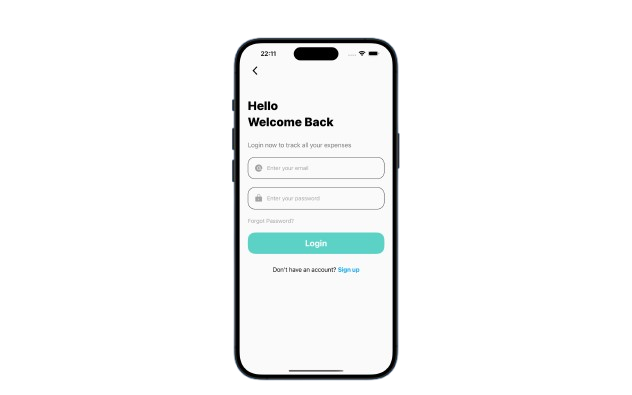
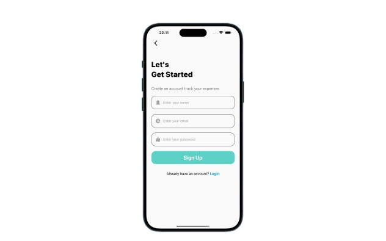
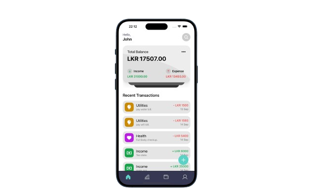
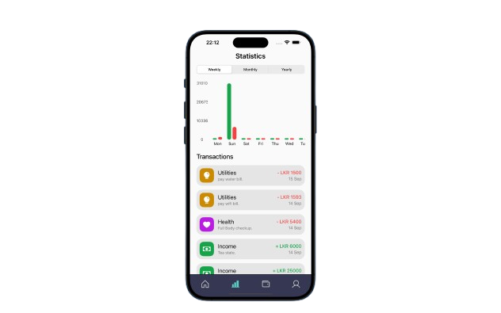
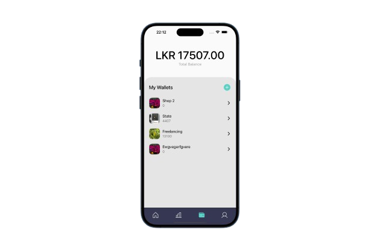
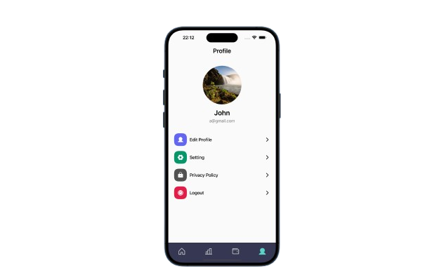
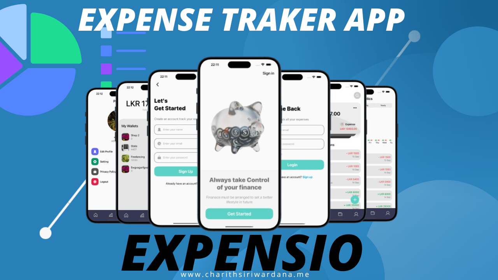

# 💰 EXPENSIO - Expense Tracker App

Hello 👋,  
This is **EXPENSIO**, my Expense Tracker App built with **React Native** and **Expo**.  
With this app, you can easily track your **expenses** and **income** with a clean and simple UI.  

---

## 🚀 Features

### 🔐 Authentication
- **Welcome Page**  
  - "Get Started" → Navigate to **Registration Page**  
  - "Sign In" → Log in with existing account  

---

### 👤 User Tab
- Upload profile picture  
- Change username  
- Logout  

---

### 👛 Wallet Tab
- See your **Total Balance**  
- Create multiple wallets (e.g., personal savings, daily expenses, trip fund)  
- Add a wallet with **name & image**  

---

### 🏠 Home Tab
- Summary card with **balance, income, and expenses**  
- View recent transactions  
- Add new **expense** or **income**  
- Update or delete transactions  
- Search transactions quickly  

---

### 📊 Statistics Tab
- Visual breakdown of **income vs. expenses**  
- Bar chart: 🟩 Income | 🟥 Expenses  
- Filter by **weekly, monthly, yearly**  
- Detailed list of transactions  

---

## 🛠️ Tech Stack

- **React Native** (Frontend)  
- **Expo** (Development & Testing)  
- **Firebase Authentication** (User login/register)  
- **Firebase Firestore** (Data storage)  

---

## 📸 Screenshots

### 🏠 Welcome Page

### 👛 Login Page

### 👛 Sign up Page

### 👛 Home Tab

### 👛 Statistics Tab

### 👛 Wallet Tab

### 👛 Profile Tab

## 🎥 Demo Video(Click This)

